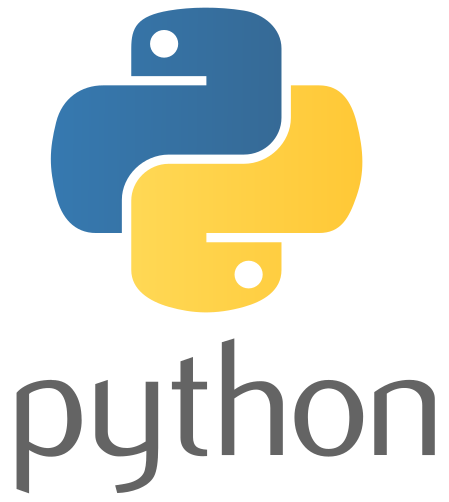
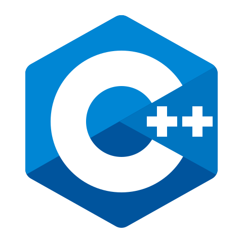

<h1 align="left"> :wave: ¡Hola mundo, aquí El Inge Silvio!</h1>
<h2 align="left">Ingeniero electricista :muscle:</h2>

- 🎓 Ingeniero electricista ⚡, egresado de la Universidad del Valle❤️.
- 🧠 Mis pasatiempos favoritos: programar, investigar curiosidades sobre electricidad y ver películas de ciencia.
- 🤓 En mi tiempo libre me gusta leer artículos científicos e investigar sobre los temas en tendencia de la actualidad.
- 📝 Me encanta compartir los datos interesantes que encuentro en la literatura sobre ingeniería eléctrica a través de vídeos en redes sociales o YouTube.

<h3 align="left">Mis lenguajes de programación favoritos 💙</h3>

<table>
    <tr>
        <td align="center">😍</td>
        <td align="center">🤩</td>
        <td align="center">😎</td>
        <td align="center">🤨</td>
        <td align="center">😐</td>
    </tr>
    <tr>
        <td align="center"></td>
        <td align="center"></td>
        <td align="center"></td>
        <td align="center"></td>
        <td align="center"></td>
    </tr>
</table>
