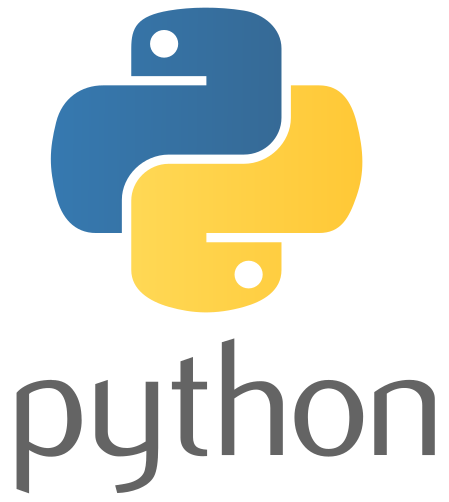

<h1 align="left"> :wave: ¡Hola mundo, aquí El Inge Silvio!</h1>

<h3 align="left">Ingeniero electricista en formación :muscle:</h3>

- 🎓 Estudiante de sexto semestre de ingeniería eléctrica ⚡
- 🥰 Mi pasatiempo favorito después de investigar curiosidades sobre electricidad es la programación :man_technologist:.
- 🧠 En mi tiempo libre me gusta resolver retos en diferentes lenguajes de programación.
- 📝 Me encanta compartir lo que aprendo a través de vídeos en redes sociales o YouTube.

<h3 align="left">🤩 Mis lenguajes de programación favoritos</h3>

<table>
    <tr>
        <td align="center">ğŸ˜</td>
        <td align="center">😊</td>
        <td align="center">🙂</td>
        <td align="center">😅</td>
        <td align="center">ğŸ˜</td>
    </tr>
    <tr>
        <td align="center"></td>
        <td align="center"></td>
        <td align="center"></td>
        <td align="center"></td>
        <td align="center"></td>
    </tr>
</table>

<!-- Test -->
